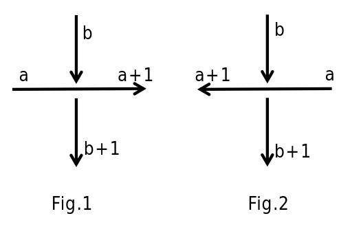
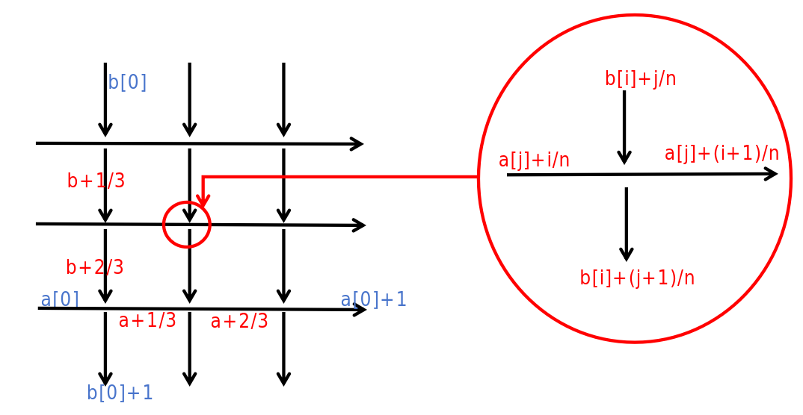

# pd-code-n-cabling
given a knot/link pd_code, get the pd_code for its n-cabling link.

## PD_CODE 四元组顺序

为了避免不同文章对于 pd_code 的定义不同，本文约定了使用的 pd_code 四元组顺序为：

- 从下方进入的 arc 开始，顺时针旋转，依次填写四个 arc 的编号。

## 方法

在 link 的 pd_code 中，从本质上讲，有且仅有两种 crossing：

1. 形如 $[b, a+1, b+1, a]$ 的 crossing（如图一）；
2. 形如 $[b, a, b+1, a+1]$ 的 crossing（如图二）；

不难证明所有 crossing 都可以被区分为上述两种，我们只需要针对上述两种结构分别构建 cabling 后的 pd_code 即可。

## 基本原则

1. 左侧新增：在进行 calbing 时，我们总是在原有的 arc 前进方向左侧增加一个新的 arc；

## 交叉点矩阵

在进行 n-cabling 后，原有的一个交叉点，会被变化为一个交叉点矩阵：

设原先 arc 的总数为 $M$，则定义 $a[j]=jM+a, b[i]=iM+b$。让 $(i, j)$ 取遍 $(0, 0)$ 到 $(n-1, n-1)$ 的所有二元整数对即可构建出所有交叉点。

在完成所有交叉点矩阵的构建之后，我们需要将所有编号重新进行**离散化操作**，在保全序不变的前提下，让编号变为整数。

